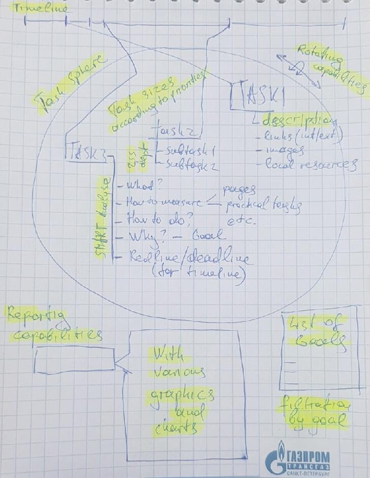

# ok-202105-tasktracker-dp
Task Tracker project, Dmitrii Poliakov

## Main idea
One-page web app for students or any professionals and goal-oriented people who would like to have a single place
for keeping all of their goals and tasks in order.  

Monetization through context ad based on analyzing user goals.  

## User portrait
Predominantly young (20-30 y.o), methodical system-minded people with a high pace of life. 
No gender prevalence is expected.
Usually come to our service from context ad in other study/work-related resources like:
- additional education courses
- looking for new work position / live success related requests, salary, selfemployment
- for such people might be common to buy some fastfood e.g. something that does not require a lot of time
  (because lack of time is the exact "pain-point" we would like to target)

## User "pain-points" and our remedy
- Multiple task trackers for work, study and life which are tedious to maintain
- A lot of users use calendars instead of task tracker which is timeline-centric approach. 
  Goal-centric approach and implicit SMART-analyse can help people understand why do they do something.
  Maybe it is unnecessary.
- A lot of task trackers do not allow prioritizing and visualizing tasks in a convenient way so user 
would not forget to do something important. This app should provide such feature.

## UI sketch

As mvp I would like to introduce:
1) Displaying currently available task list with filters
2) Task creation
3) Task properties editing functionality
4) Task deletion

Where the task should possess such attributes to conform SMART model:
1) Name
2) Description with such separation 
   - Specific (just elaborated description of what is needed to be done)
   - Attainability (how are we going to achieve this result -> an exact plan)
   - Measurably (description + current status in percent)
   - Relevance (why do we need this task to be done? What it would give us?)
3) Due time (Time bound)
4) Link to another task as subtask or parent-task

Everything else like:
- reporting capabilities
- goal as a separate entity with its own behaviour
- rich UI features 
Are not included in mvp but can be implemented in the future